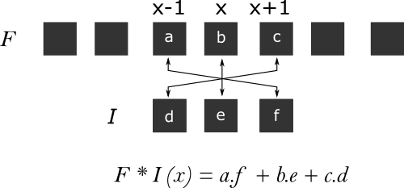
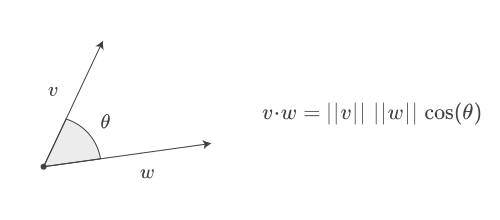

Convolution and Correlation are two mathematical operations you are likely to encounter often if you are interested in signal processing and the underlying ideas show up in a lot of other fields of study stemming from statistics, so lets make an attempt to simplify what they mean.

first lets talk about the dot product, the dot product between two vectors is the sum over the products of values at corresponding positions of two vectors

for two vectors :

$$X = [\  a , b , c \ ]$$

and

$$Y = [\  d , e , f \ ]$$

the dot product simply is defined as :

$$X . Y = a . d + b . e + c . f$$

the dot product also encodes some interesting geometric properties which we will discuss shortly.

the terms convolution and correlation show up often in signal processing, and are intimately tied to the ideas of composition and dependence respectively. to convolve two things is to combine them, and to correlate two things is to compare them and infer a relationship . both convolution and correlation operations are represented similarly with only a tiny difference and when the signals are discrete signals, they can be calculated using the dot product. the figures below show the expressions of convolution and correlation between two signals \\(F\\) and \\(I\\) . notice how both are similar in terms of summation and product and differ in the components that are being selected for multiplication. for a sample surrounded around the location \\(x\\) . convolution selects \\(I(x-i)\\) while correlation selects \\(I(x+i)\\)

convolution of two signals :
$$
F * I(x) = \sum_{i=-N}^{N} F(i)I(x-i)
$$

correlation of two signals :
$$
F \circ I(x) = \sum_{i=-N}^{N} F(i)I(x+i)
$$

correlation between two signals
if signals are represented by an array of numbers, and let F and I be two signals, the calculation of convolution and correlation of those two signals at a point x is illustrated below.

convolution of F and I at x :

correlation between F and I at x :

if you notice, you can see that convolution between two signals \\(F\\) and \\(I\\) is equivalent to correlation between \\(F\\) and a signal that is obtained by flipping values of \\(I\\) . i,e ..

$$
[\  a ,\  b ,\  c \ ] * [\  d ,\  e ,\  f \ ] = [\  a ,\  b ,\  c \ ] \circ [\  f ,\  e ,\  d \ ]
$$

note that the above single evaluation is centered around x, and we are talking about convolution and correlation of those two signals only at that particular point. the result of convolution or correlation is often another signal of length equal to the number of evaluations. in the example above, the evaluations are obtained by overlapping I for every point in F . the result in the case of convolution can be treated as the composited output from combination of two input signals, and for correlation it can be treated as measure of similarity between two signals so the point at which we get maximum correlation is probably where two signals look similar or overlap more.

for the purposes of this post we are interested in observing how convolution and correlation are contrasted in terms of representation and how a tiny difference in how they are defined leads to entirely different applications.

it might sound counter intuitive that convolution which considers the reflection to calculate the dot product actually produces the signal itself when convolved with an impulse signal ( a signal with a value of 1 at one instance and 0 everywhere such as [0,0,0,0,1,0,0,0,0] ) where as correlation produces a reversed signal .

note that, convolution with an impulse function produces a copy of input signal at the impulse and if the impulse were to be of a different magnitude say 2 . then the result would also be scaled by 2 . now we are ready to discuss one of the applications where convolution has a deeper meaning.

## Convolution as a composition of two signals
### LTI systems
In order to study physical systems we usually describe them in terms of a set of equations that capture relations between the inputs and outputs of that system, collectively those equations are called a mathematical model. often, we are interested in studying how the input affects the response/ output of a system and right now we are interested in one particular class of systems called the Linear Time Invariant systems or LTI systems for short. an LTI system is characterized by two properties, Linearity and Time Invariance.
#### Linearity
Linearity implies that the system’s response obeys principle of superposition which states that the overall response of a system for multiple stimulii given at same input is equal to the sum of responses of individual stimuli. in other words , if input is twice as strong then the output will also be twice as strong .
#### Time Invariance
Time Invariance implies that the response of system at some instant is only dependent on the input at that instant and is independent of past or future inputs. which is to say, input at some instant doesn’t alter the system’s state in a way it would produce a different response at another instant than its natural response to that input.

#### The Impulse Response
one interesting property of an LTI system is that everything about the system’s response can be characterized by a single response called ” the impulse response ” of that system . and the system’s response to any arbitrary input can be obtained by convolving that input signal with the system’s impulse response. which is to say all responses of an LTI system for any given input are simply shifted and scaled versions of impulse response .

the impulse response of a system can be obtained by giving it an input which is short lived in time . gun shots are one good example of an impulse response, where the pressure wave from barrel when the gun is fired is input and the sound it produces is the response and the surrounding chamber where the gun was fired represents the system. in fact this example is taken from prof. Allen Downey’s talk where he takes an audio sample of a gun shot which is an impulse response in a firing range, and then he takes another audio of a violin being played, and on convolving both signals we get an audio clip which sounds like the violin is being played in a firing range . it is highly recommended to watch the whole talk and here is an embed with the timestamp.



## Correlation as a measure of similarity and dependence
earlier for any two vectors X and Y we have introduced the dot product as follows
$$
X.Y = a.d + b.e + c.f
$$
another way to calculate the dot product is by using this relation :
$$
X.Y = | X | . | Y | . cos(θ)
$$
where \\(| X |\\) and \\(| Y |\\) are magnitudes of vectors \\(X\\) and \\(Y\\) and \\(θ\\) is angle between them . since \\(θ\\) varies from 0 to 180 ( acute angle ) , \\(cos(θ)\\) varies between -1 and 1 .

### Geometric interpretations of the dot product
if X and Y are properly aligned in the same direction then θ is zero and and the dot product is maximum and is equal to \\(| X | . | Y |\\) , where as if they are aligned in opposite directions then θ is 180 and the dot product goes to minimum \\(– | X | . | Y |\\) . this can also be looked at from a different point of view, if components of \\(X\\) and \\(Y\\) are different then the angle between them will be greater than 0 , and \\(cos(θ)\\) will be less than 1. the dot product thus tells us something about the orientation of two vectors in space.
 

but this isn’t enough to conclude two vectors are similar, for one the result is still dependent on magnitudes of \\(X\\) and \\(Y\\) and isn’t standard. this notion of similarity doesn’t make sense when we are making comparisons with vectors with wide range of values , hence we need to think of a way to make correlation independent of the scale of values, this can be done by normalizing the magnitudes of \\(X\\) and \\(Y\\) to 1 . so how do we do that ?

The first and simplest way would be to divide each vector with its magnitude this ensures that the dot product always lies between -1 and 1 . then the dot product’s meaning will always be unambiguous and clearly mean if vectors are aligned close to each other or apart from each other. we can also use a different method to normalize the vectors \\(X\\) and \\(Y\\).

## Covariance 
if \\(X\\) contains samples of some random variable , and \\(Y\\) contains samples of another random variable, then subtracting each of entries with their respective means shifts the values close to zero, and then the vectors start representing deviations from mean, if values in \\(X\\) and \\(Y\\) simultaneously increase and decrease , then so would their deviations from mean, computing correlation between these modified vectors gives us similarity in variation of one variable with respect to another and is often called the covariance of two variables. the result is often then divided by number of elements to reduce the scale of result.

$$
\mathrm{Cov}(X, Y) = \frac{1}{n} \sum_{i=1}^{n} (x_i - m_x)(y_i - m_y)
$$

covariance doesn’t guarantee a standard range, so it is still dependent on scale of deviations, and hence if we divide covariance of \\(X\\) and \\(Y\\) with standard deviations of \\(X\\) and \\(Y\\) the range can be standardized to ( -1 , 1 ). the resulting metric is called the correlation coefficient and is given by .

$$
Correlation = \frac{Cov(x, y)}{\sigma_x * \sigma_y}
$$

where standard deviation \\(\sigma\\) for any vector x is calculated as :

$$
\sigma = \sqrt{\frac{1}{N} \sum_{i=1}^{N} (x_i - \mu)^2}
$$

where \\(μ\\) is mean of \\(X\\) , so this term is guaranteed to be greater than any term in numerator comprising corresponding vector and hence Correlation coefficient defined like this always lies in the range (-1,1) and would imply strength of linear relationship between two variables . a value close to 1 would imply a strong positive correlation meaning \\(X\\) and \\(Y\\) increase and decrease simultaneously so it could be possible to fit a straight line with positive slope to the points. and a value close to -1 would imply a strong negative correlation between \\(X\\) and \\(Y\\) which would mean, if \\(X\\) increases \\(Y\\) would decrease and vice verse . in this case we can fit a straight line with negative slope to the points. a value close to 0 doesn’t tell us anything about the kind of relationship between \\(X\\) and \\(Y\\), it only points away from linearity. if you ever come across any of the terms discussed here having a different representation or formula then bear in mind that it is common to find metrics defined in a slightly different way. as long as you understand how the metrics are related to certain properties it shouldn’t matter.

