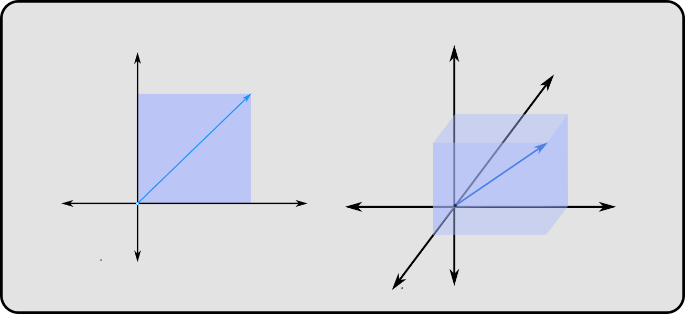

when we multiply a matrix with a vector or a set of vectors (another matrix), we get vector or a set of vectors as result. now matrix multiplication can be looked at as a transformation or a linear map (things are scaled and combined) that takes as input a vector or a matrix and maps it to different vectors and matrices.

## The Inverse
some characteristics of such transformation are of importance to us, that give us insight into what these transformations do geometrically. we care about solving problems and oftentimes that involves tracing our way back to understand the conditions that create the observations. like in case of machine learning, where the neural networks approximate the function that generated the outputs given the inputs. although neural networks can model complex non-linear mappings, some real world problems can be modeled as a system of linear equations and solving them just requires finding an inverse of a matrix (the traceback step given the outputs and inputs).

## Singularities
this is not always possible. for example if we want to figure out what \\(x\\) and \\(y\\) are given their product is \\(0\\), it's not possible. if one of them is zero, the other can be any number. so we see that some operations have singularities that collapse means to apply inverse. or for some values the information goes into singularity and we run out of ways to work our way back. we find such singularity cases in matrix multiplications too.

## volume of vectors
we are well familiar with vectors having a direction and length. but we can also associate Area (2D), Volume (3D) or Hyper Volume in higher dimensions if the vector has more than 3 elements.

so when transformed by a matrix, the vector changes and this changes the associated Area/Volume/Hyper-Volume. the factor by which the volume changes is given by the determinant of that matrix. 

## Transformation by Singular Matrices
when multiplied by singular matrices however, the determinant becomes zero. this happens when there is a linear dependency between rows or columns of a matrix. so if there are \\(n\\) columns, one of more of those can be obtained by a linear combination of other columns. this means the columns don't actually span the space with \\(n\\) dimensions, and the hyper cuboid formed is collapsed to a subspace which is spanned by the columns. the matrix in this case is said to have rank deficiency.



since the third column/basis, the blue vector lies in the same plane as the other two vectors, the transformation can only create planes and hence the determinant is 0, because this collapses points onto a plane.
## Eigen vectors and Values
for any non zero vector \\(\vec v \\), if a linear transformation \\( A_{n \times n} \\) only scales the vector by some magniture \\( \lambda \\) then \\( \vec v \\) is called an eigen vector and the scaling factor \\( \lambda \\) is called the eigen value.
$$ A \cdot \vec v = \lambda \vec v $$

## Finding Eigen Values
from the above equation it follows that :

$$ A \cdot \vec v = \lambda I \cdot \vec v $$
$$ {[\\ A - \lambda I \\ ]}\cdot{\vec v}  = 0 $$

let \\( {[\\ A - \lambda I \\ ]} \\) be \\( B\\)
$$ B \cdot \vec v = 0 $$
which is only true when
$$\vec v = 0 $$ 
or every row in \\(B\\) is orthogonal to \\(\vec v\\). Expanding the dot product we have :

$$
\begin{bmatrix}
    \overrightarrow {b_{r1}}  \newline
    \overrightarrow {b_{r2}}  \newline
    \overrightarrow {b_{r3}}  \newline
   \vdots \newline
    \overrightarrow {b_{rn}} 
\end{bmatrix} \cdot \vec v = 
\begin{bmatrix}
    \overrightarrow {b_{r1}} \cdot \vec v \newline
    \overrightarrow {b_{r2}} \cdot \vec v \newline
    \overrightarrow {b_{r3}} \cdot \vec v \newline
   \vdots \newline
    \overrightarrow {b_{rn}} \cdot \vec v
\end{bmatrix} = 
\begin{bmatrix}
    0 \newline
    0 \newline
    0 \newline
   \vdots \newline
    0
\end{bmatrix}
$$

excluding the trivial case where \\(\vec v \in \mathbb{R^n}\\) is \\(0\\), we can observe that the rows must occupy a subspace whose dimensionality has to be less than \\(n\\). in other words, since \\(\vec v \\) is orthogonal to rows in \\(B\\) no linear combination of those rows can create \\(\vec v \\), a vector in \\(\mathbb{R^n}\\). thus the scaling factor for the volume of hypercuboid represented by \\(\vec v \\) (the determinant), is 0 when it is transformed by \\(B\\), because the dimensionality of \\(B\\) is less than \\(n\\), causing the transformation to collapse the hypercuboid in some direction.
therefore it follows that:
$$
| A - \lambda I | = 0
$$
which gives us a polynomial equation of degree \\(n\\) whose zeros are eigen values for the matrix \\(A\\)
