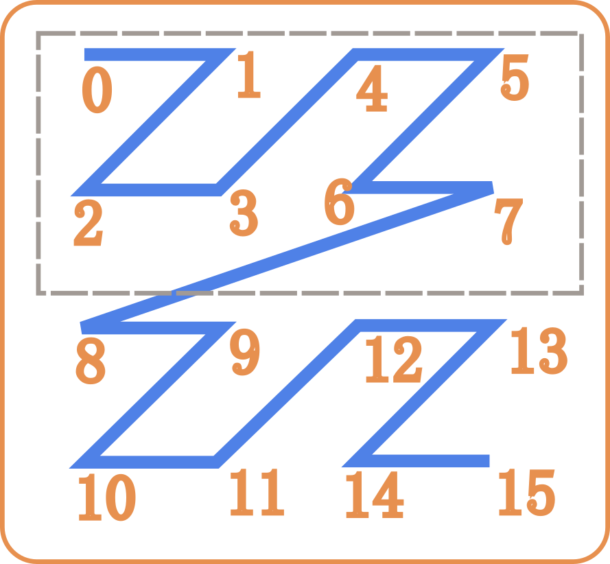

## The Problem
While prototyping different algorithms that work on point clouds, I would often run into an issue. although I had point clouds with just a few million points for prototyping, when testing the algorithms on larger clouds, with 100s of millions or billions of points, the applications quickly became memory intensive taking most of available memory (10s of gigabytes).

oftentimes the point clouds also come with additional data attached to each point making them resource intensive to work with. so I Looked for ways to optimize ways of loading, querying and storing the point clouds for easier processing.

the first thing I did was to separate the xyz coordinate data from the point cloud. one operation I cared the most about and most people would often find themselves doing is getting a cropped section of the pointcloud, like a bounding box crop. 

ideally we create data structures such as a KD-Tree or an Octree from a pointcloud, that can crop the pointcloud in logarithmic time. but since the whole cloud would have to be loaded in memory, any method that uses in-memory optimization will be resource intensive.

## Two Approaches
one thing that became immediately obvious was, to create an Octree or KD-Tree once, break the pointcloud into grid cells. write the grid cells onto disk and use a map to load points dynamically from the disk. we could do this in two ways, either we write points in each grid cell to its own file. which would mean we'd have to load a section of point cloud from multiple files, or we could merge the points from all grid cells into a single file and have an index map for querying. 

## Spatial Locality
there's one more consideration here. file-IO works faster when the data to be read is contiguous. if we write the point cloud to disk as multiple files, then the reads would be relatively expensive than reading an index range from a single file. is there a way to sort the points such that range queries would on average be contiguous ? can we sort the points or grid cells in such a way that points closer in 3D are also closer when stored as a single array on disk ? can we preserve this property called **Spatial Locality** while saving the points to disk ? Space filling curves do just that. and this is how what is known as a Z-order curve or morton order curve, helped me efficiently process point clouds by improving file-IO and memory requirements of my algorithms. 

## Z order - Morton order
the name Z-order comes from the zig-zag Z like pattern that emerges when we combine the bits of numbers by interleaving them.

take four numbers, 0,1,2,3
in binary representation with two bits, they are 00, 01, 10 and 11
let's say you want to calculate the morton code for a point in 2D \\((2,3)\\).

binary representation of 2 is 10
binary representation of 3 is 11
to calculate the morton code, we dilate the bits of 2, in other words we make space for the bits of 3 and also dilate the bits of 3.
$$
2 = {(\color{lime}{1 \text\_ 0 \text\_})}_b
$$
$$
3 = {(\color{violet}{\text\_ 1 \text\_ 1 })}_b
$$

then we combine them both

$$
MortonCode(2,3) = \color{lime}{1}\color{violet}{1}\color{lime}{0}\color{violet}{1}
$$

similarly if we find morton codes for all 16 points (x,y) where x or y can be any of [0,1,2,3].
$$
\begin{array}{|c|c|c|c|c|}
\hline
y \backslash x &  \color{lime}{00} & \color{lime}{01} & \color{lime}{10} & \color{lime}{11}  \newline
\hline
\color{violet}{00} & 
\color{lime}{0}\color{violet}{0}\color{lime}{0}\color{violet}{0} & 
\color{lime}{0}\color{violet}{0}\color{lime}{0}\color{violet}{1} & 
\color{lime}{0}\color{violet}{1}\color{lime}{0}\color{violet}{0} & 
\color{lime}{0}\color{violet}{1}\color{lime}{0}\color{violet}{1} \newline
\hline
\color{violet}{01} & 
\color{lime}{0}\color{violet}{0}\color{lime}{1}\color{violet}{0} & 
\color{lime}{0}\color{violet}{0}\color{lime}{1}\color{violet}{1} & 
\color{lime}{0}\color{violet}{1}\color{lime}{1}\color{violet}{0} & 
\color{lime}{0}\color{violet}{1}\color{lime}{1}\color{violet}{1} \newline
\hline
\color{violet}{10} & 
\color{lime}{1}\color{violet}{0}\color{lime}{0}\color{violet}{0} & 
\color{lime}{1}\color{violet}{0}\color{lime}{0}\color{violet}{1} & 
\color{lime}{1}\color{violet}{1}\color{lime}{0}\color{violet}{0} & 
\color{lime}{1}\color{violet}{1}\color{lime}{0}\color{violet}{1} \newline
\hline
\color{violet}{11} & 
\color{lime}{1}\color{violet}{0}\color{lime}{1}\color{violet}{0} & 
\color{lime}{1}\color{violet}{0}\color{lime}{1}\color{violet}{1} & 
\color{lime}{1}\color{violet}{1}\color{lime}{1}\color{violet}{0} & 
\color{lime}{1}\color{violet}{1}\color{lime}{1}\color{violet}{1} \newline
\hline
\end{array}
$$

if you look at the resulting values from morton encoding and trace the order you can see the Z-ordering.
$$
\begin{array}{|c|c|c|c|c|}
\hline
y \backslash x &  \color{lime}{0} & \color{lime}{1} & \color{lime}{2} & \color{lime}{3}  \newline
\hline
\color{violet}{0} & \color{orange}{0} & \color{orange}{1} & \color{orange}{4} & \color{orange}{5} \newline
\hline
\color{violet}{1} & \color{orange}{2} & \color{orange}{3} & \color{orange}{6} & \color{orange}{7} \newline
\hline
\color{violet}{2} & \color{orange}{8} & \color{orange}{9} & \color{orange}{12} & \color{orange}{13} \newline
\hline
\color{violet}{3} & \color{orange}{10} & \color{orange}{11} & \color{orange}{14} & \color{orange}{15} \newline
\hline
\end{array}
$$

as you can observe the points closer in 2D are also close to each other along the curve in order and if I wanted to read the points in the cropping box, all the numbers are contiguous and I just need one ranged query to read, from index 0 to 7.

of course it's seldom the case for real world data to be so clean. nonetheless the method can be applied to get a similar result. below is a random instance of the same, I created a set of random points in 2D in the range (0,width) and (0,height) for x and y coordinates of the points. the width and height of the canvas are close to 500 pixels, so the points are more spread apart than our earlier range [0,3] for x and y. 

by default you will only see the points. tap to cycle through different orders of points. the second mode displays the order in which points are generated. the third one displays the order after the points are sorted using their morton codes.


